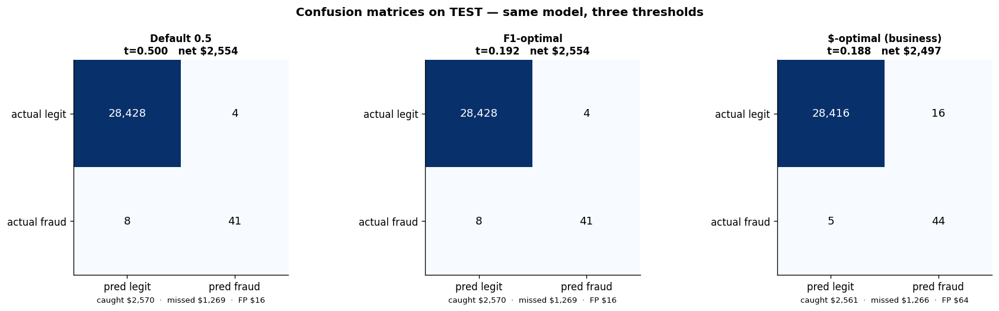

# Cost-Optimized Fraud Detection: Analytical Showcase


An end-to-end analytical pipeline and machine learning implementation for credit card fraud detection. Utilizing the Kaggle `creditcardfraud` dataset (284,807 transactions, 0.172% fraud), this project focuses on **cost-optimal thresholding** rather than pure statistical maximization. The system is designed to minimize net business losses by balancing fraud recovery against the operational cost of analyst reviews.

## Interactive Management Report

The cornerstone of this showcase is the **Interactive Analytics Report**, located at `reports/html/index.html`. 

- **Design**: Styled with a clean, professional Notion-inspired aesthetic, utilizing concise typography and a structured sidebar for seamless navigation.
- **Content**: Consolidates rich data visualizations across all phases of the project into a single, cohesive document.
- **Workflows**: Documents the complete end-to-end technical workflows, from raw data ingestion to executive KPI aggregation, making complex machine learning pipelines accessible to business stakeholders.

## Key Business Metrics & Terminology

Bridging the gap between data science and business operations requires clear metrics. The following concepts and abbreviations are utilized throughout the pipeline:

- **PR-AUC (Precision-Recall Area Under Curve)**: Evaluates the trade-off between detecting fraud and issuing false alarms. *Business Value*: The primary performance metric for highly imbalanced datasets, ensuring the model's accuracy isn't artificially inflated by the overwhelming number of legitimate transactions.
- **Recall (Sensitivity)**: The percentage of total fraudulent transactions successfully intercepted. *Business Value*: Directly correlates to mitigated financial loss and protected revenue.
- **Precision**: The percentage of flagged alerts that are genuinely fraudulent. *Business Value*: Drives operational efficiency by minimizing "alert fatigue" and reducing the labor costs associated with manual analyst reviews.
- **SHAP (SHapley Additive exPlanations)**: A game-theoretic framework for explaining machine learning outputs. *Business Value*: Provides transparency and auditability, empowering risk management teams to understand exactly *why* a specific transaction was blocked or flagged.
- **PCA (Principal Component Analysis)**: A statistical procedure used to convert observations into uncorrelated variables. *Context*: In this dataset, PCA components (V1-V28) protect customer privacy and confidentiality while preserving predictive variance.

## The Data - Fact Findings
Three views of the same 24-hour cycle:
- **Volume** — most transactions happen 9am–11pm.
- **Fraud rate %** — risk-by-row spikes 2–5am (card-testing pattern).
- **$ loss** — even rare fraud at busy hours can dominate raw dollar loss.


Most of the fraudulent rate is petty. The rate peaks on **small amounts** (testing stolen cards) with a long tail above $100. Histogram, ECDF, and bucketed-rate panels triangulate the same story.


The Signals - the most important features


## Analytical Pipeline & Technical Workflows (Notebooks)

The project is structured across a sequential series of analytical notebooks, ensuring reproducibility and logical flow:

- **`00_overview.ipynb`**: High-level project orchestration and objective setting.
- **`01_ingestion_duckdb.ipynb`**: Efficient raw data ingestion and profiling via DuckDB. Implements rigorous pre-split de-duplication to prevent data leakage.
- **`02_eda.ipynb`**: Exploratory Data Analysis. Visual inspection of distributions, feature correlations, and the fundamental class imbalance.
- **`03_data_quality.ipynb`**: Data integrity validation, missing value checks, and baseline anomaly detection.
- **`04_preprocessing.ipynb`**: Robust data scaling and transformation. All scalers are strictly fitted on training data to simulate real-world deployment constraints.
- **`05_feature_engineering.ipynb`**: Derivation of cyclical temporal features and log-transformed transaction amounts to capture complex, non-linear fraud signals.
- **`06_ml_prediction.ipynb`**: Core modeling leveraging XGBoost. Prioritizes isotonic regression to yield meaningful, well-calibrated probability scores rather than raw, uncalibrated margins.
- **`07_business_impact.ipynb`**: Translating model probabilities into financial outcomes. Sweeps for the optimal decision threshold based on a defined cost function (e.g., $4 cost per false positive manual review). Features SHAP-based interpretability.
- **`08_unsupervised_appendix.ipynb`**: Evaluates Isolation Forests as a baseline methodology for environments lacking labeled fraud data.
- **`09_business_insights.ipynb`**: Final aggregation of KPIs, summarizing net financial impact and model robustness for executive stakeholders.

## Business Impact & Results (Held-out Test Set)

The model threshold (0.1875) was strictly derived by maximizing net dollars saved on a validation set, assuming a missed fraud costs the transaction amount and a false alarm costs $4 in operational review time.

| Metric | Performance |
|---|---|
| **Net Saved vs. Baseline** | $2,497 |
| **Fraud Cases Caught (Recall)** | 89.8% |
| **Fraud Dollars Recovered** | 64.0% |
| **Precision** | 73.3% |
| **PR-AUC** | 0.886 |



*Observation*: While the system intercepts 89.8% of fraudulent events, it recovers 64.0% of the associated financial value. This indicates that missed fraud events skew toward higher transaction values—a critical insight prioritizing future feature engineering over marginal statistical improvements.

## Architecture & Data Flow

```text
Raw CSV -> DuckDB (Profile & Deduplicate) -> Parquet -> Stratified Split
        -> Preprocessor (Fit on Train) -> Calibrated XGBoost
        -> Cost-Optimal Thresholding -> Interactive HTML Report
```

- **Data Leakage Prevention**: De-duplication (1,081 exact duplicates) is executed prior to the stratified split, ensuring no overlap between training, validation, and test partitions.
- **Imbalance Strategy**: Handled intrinsically via `scale_pos_weight` rather than destructive sampling methods (like undersampling the majority class).

## Repository Structure

```text
src/fraud/   # Core pipeline modules: config, io, data, features, modeling, report
tests/       # Pytest suite (~90% coverage on core logic)
notebooks/   # 00-09 sequential analytical workflows
reports/     # Generated figures and the consolidated interactive HTML report
docs/        # System design specifications and architectural plans
```

## Reproduction

Environment setup is managed via `uv`:

```bash
# Install dependencies
uv sync --extra dev

# Execute unit tests
uv run pytest
```

*Note: The raw dataset is external. Download `creditcard.csv` (Kaggle: `mlg-ulb/creditcardfraud`) into `data/raw/` prior to running `01_ingestion_duckdb.ipynb`.*

## Acknowledgments
Built on foundational concepts adapted from @amalinadhi and @davidsirait (Pacmann.io, 2024). Original dataset provisioned by Université Libre de Bruxelles (ULB) via Kaggle.
